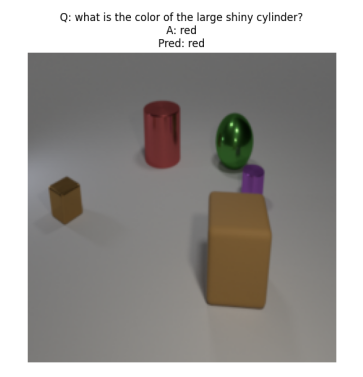
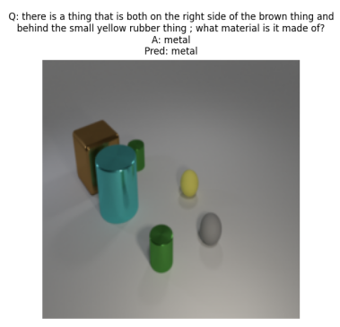

# 🧠 Visual Question Answering on CLEVER Dataset

This repository implements a Visual Question Answering (VQA) system evaluated on the **CLEVER dataset** (COL774 A4 assignment). The task involves answering questions about images that require reasoning about object properties and relationships.

---

## 📁 Dataset

**CLEVER Dataset (COL774 A4):**
Available on Kaggle: [https://www.kaggle.com/datasets/aayushkt/col774-a4-dataset](https://www.kaggle.com/datasets/aayushkt/col774-a4-dataset)

**Directory Structure:**

```
CLEVR_COL774_A4/
│
├── images/
│   ├── testA/
│   │   ├── <image1>.png
│   │   └── ...
│   ├── testB/
│   │   ├── <image2>.png
│   │   └── ...
│   ├── trainA/
│   │   ├── <image3>.png
│   │   └── ...
│   ├── valA/
│   │   ├── <image4>.png
│   │   └── ...
│   └── valB/
│       ├── <image5>.png
│       └── ...
│
└── questions/
    ├── CLEVR_testA_questions.json
    ├── CLEVR_testB_questions.json
    ├── CLEVR_trainA_questions.json
    ├── CLEVR_valA_questions.json
    └── CLEVR_valB_questions.json
```

---

## 🚀 Getting Started

### 🔧 Requirements

Install the required Python packages:

```bash
pip install -r requirements.txt
```

### 🏁 Running Inference

**Test A and Test B:**

```bash
python3 part11.py \
  --model_path <path_to_checkpoint> \
  --mode inference \
  --dataset <path_to_dataset_folder>
```

**All metrics for Dataset A:**

```bash
python3 part10b.py \
  --model_path <path_to_checkpoint> \
  --mode inference \
  --dataset <path_to_dataset_folder>
```

---

## 📊 Evaluation & Results

We report performance on the validation and test splits for various stages of the pipeline. Metrics include Loss, Accuracy, Precision, Recall, and F1-score.
Metrics sourced from our assignment report. fileciteturn0file0

### Baseline Model (Frozen ResNet101)

| Split        | Loss   | Accuracy | Precision | Recall | F1-score |
| ------------ | ------ | -------- | --------- | ------ | -------- |
| Validation A | 0.6722 | 0.6985   | 0.5517    | 0.5673 | 0.5444   |
| Test A       | 0.6577 | 0.6975   | 0.5203    | 0.5276 | 0.5183   |

### Fine-tuned Image Encoder (Unfrozen ResNet101)

| Split        | Loss   | Accuracy | Precision | Recall | F1-score |
| ------------ | ------ | -------- | --------- | ------ | -------- |
| Validation A | 0.4899 | 0.7703   | 0.6512    | 0.6213 | 0.6291   |
| Test A       | 0.4954 | 0.7707   | 0.6800    | 0.6258 | 0.6350   |

### Zero-shot & Cross-split Evaluation

| Split        | Loss   | Accuracy | Precision | Recall | F1-score |
| ------------ | ------ | -------- | --------- | ------ | -------- |
| Train        | 0.4139 | 0.8068   | 0.6698    | 0.6416 | 0.6507   |
| Validation A | 0.4899 | 0.7703   | 0.6512    | 0.6213 | 0.6291   |
| Test A       | 0.4954 | 0.7707   | 0.6800    | 0.6258 | 0.6350   |
| Test B       | 1.6795 | 0.6556   | 0.4894    | 0.4718 | 0.4765   |

---

## 🔍 Sample VQA Examples

Below are a few sample instances from the CLEVER dataset.
| Image                            | Question                              | Answer |
| -------------------------------- | ------------------------------------- | ------ |
|  | What color is the sphere on the left? | Yellow |
|  | How many cubes are there?             | Three  |

---

## 📎 Citation

If you use this codebase or dataset, please consider citing the original CLEVER dataset authors.

---

## 📬 Contact

For questions, feel free to open an issue or contact the maintainer.
